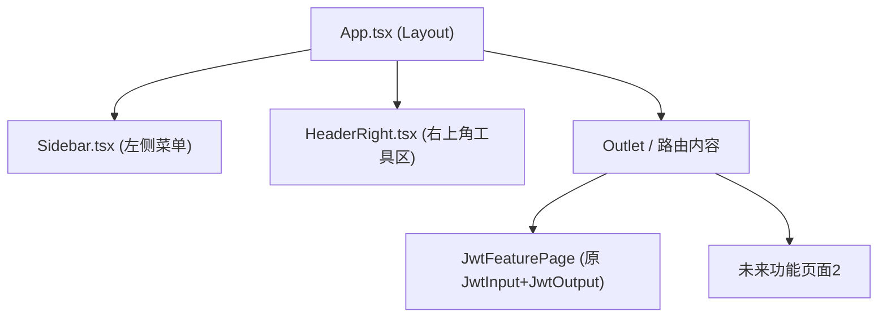

# DeepWiki Q&A with Code Context for Repository: icetech233/jwtparse
## Q1
这个项目目前只有jwt解码，后续要加别的功能，layout 左侧加 菜单栏怎么改造，给详细技术方案，
### Answer
## 概览

当前 `App.tsx` 是一个单页布局：顶部标题+`HeaderRight`工具区，下方左右两栏（`JwtInput` / `JwtOutput`）<cite repo="icetech233/jwtparse" path="src/App.tsx" start="39-75" end="39-75" />。要支持后续多功能扩展，需要引入**左侧菜单栏 + 路由 + 视图容器**的整体改造。

---

## 详细技术方案

### 1. 引入路由（react-router）
当前项目没有路由，只有一个 `App` 组件直接渲染 JWT 功能<cite repo="icetech233/jwtparse" path="src/App.tsx" start="35-37" end="35-37" />。建议引入 `react-router-dom`，把「JWT 解码」变成路由下的一个页面（如 `/jwt`），后续新增功能各自一个路由。

### 2. 新增布局层 `Layout.tsx`
把现在 `App.tsx` 里的顶部 header 和主内容区拆开：
- 新建 `Sidebar.tsx`（左侧菜单栏），列出功能入口（JWT解码、未来功能A、功能B...），使用 `NavLink` 高亮当前路由。
- `App.tsx` 改为整体三段式布局：`Sidebar` + `main`（`HeaderRight` 仍放右上角 + `<Outlet />` 渲染当前功能页面）。

结构示意：



### 3. 把现有 JWT 功能抽成独立页面组件
现在 `jwtInput` 状态、`useJwt` hook 调用、`JwtInput`/`JwtOutput` 渲染都耦合在 `App.tsx` 里<cite repo="icetech233/jwtparse" path="src/App.tsx" start="36-37" end="60-75" />。改造时应把这部分整体搬到一个新文件如 `pages/JwtDecodePage.tsx`，`App.tsx` 只保留布局壳，不再关心具体功能逻辑。

### 4. Sidebar 组件设计要点
- 参考 `HeaderRight.tsx` 现有的圆形图标按钮风格与 Tailwind 语义化 class（`bg-muted`、`text-foreground`、`ring-ring`等）保持视觉一致<cite repo="icetech233/jwtparse" path="src/components/HeaderRight.tsx" start="52-56" end="52-56" />。
- 主题切换逻辑（`.dark` class + `localStorage`）由 `HeaderRight` 管理<cite repo="icetech233/jwtparse" path="src/components/HeaderRight.tsx" start="45-50" end="45-50" />，Sidebar 直接复用现有 CSS 变量（`--background`、`--card`等，定义于 `global.css`）即可自动适配明暗主题<cite repo="icetech233/jwtparse" path="src/global.css" start="1-31" end="1-31" />，无需改动。
- 建议菜单项数据用一个数组配置（`{ path, label, icon }[]`），方便后续新增功能时只需追加一项。

### 5. 响应式处理
当前主内容区已用 `flex flex-col lg:flex-row` 做大屏左右分栏、小屏堆叠<cite repo="icetech233/jwtparse" path="src/App.tsx" start="59-59" end="59-59" />。加入侧边栏后，需要在小屏下把 Sidebar 折叠为顶部/汉堡菜单，大屏下固定宽度（如 `w-56`）悬浮在内容左侧，主内容区整体再套一层 `flex`。

### 6. 动画与懒加载策略延续
- `motion` 的 stagger 动画（`containerVariants`/`itemVariants`）可以保留，应用到 Sidebar 菜单项的入场动画<cite repo="icetech233/jwtparse" path="src/App.tsx" start="18-33" end="18-33" />。
- 每个功能页面（包括新 JWT 页面）应各自 `lazy()` 加载，参考现有 `JwtOutput` 的懒加载方式<cite repo="icetech233/jwtparse" path="src/App.tsx" start="14-16" end="14-16" />，配合路由的 `Suspense` 边界，避免所有功能代码打入一个 bundle。

### 7. 文件结构建议

```
src/
├── App.tsx              # 仅布局壳：Sidebar + HeaderRight + <Outlet/>
├── router.tsx            # 路由表定义
├── components/
│   ├── Sidebar.tsx        # 新增：左侧菜单
│   ├── HeaderRight.tsx    # 保持不变
│   └── ...
├── pages/
│   ├── JwtDecodePage.tsx  # 原 JWT 功能，从 App.tsx 抽出
│   └── FutureFeaturePage.tsx
└── hooks/
    └── useJwt.ts          # 保持不变，被 JwtDecodePage 调用
```

